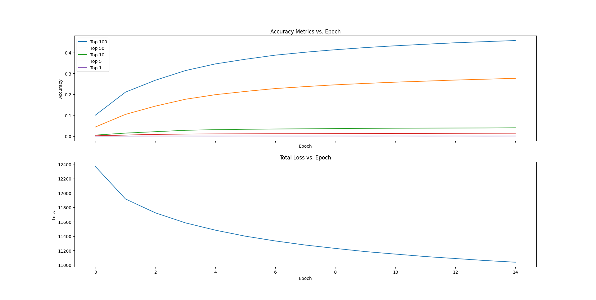

# Introduction
Welcome to my repository! This is nothing serious, it's just a location for me to play around with recommender
algorithms of differing sorts.

### book_recommendations.py
This file uses [Surprise](https://github.com/NicolasHug/Surprise/) to make predictions on the rating a user will give
a specific book and it uses the Book Recommendations Dataset uploaded to Kaggle by Mobius 
[here](https://www.kaggle.com/datasets/arashnic/book-recommendation-dataset). If you wish to play with this,
then you'll have to edit the code to point to where you downloaded the data.

### movielense_watch_recommendations.py
This file uses [tensorflow-recommenders](https://github.com/tensorflow/recommenders) to make recommendations to users on
what to watch, using the [movielens-100k](https://grouplens.org/datasets/movielens/100k/) dataset. It uses the 
[tensorflow-datasets](https://github.com/tensorflow/datasets/) library to import the data, so you shouldn't have to 
change any filepaths if you wish to use this on your own. The **movielens_1.png** image shown below displays some 
training results from the script.
